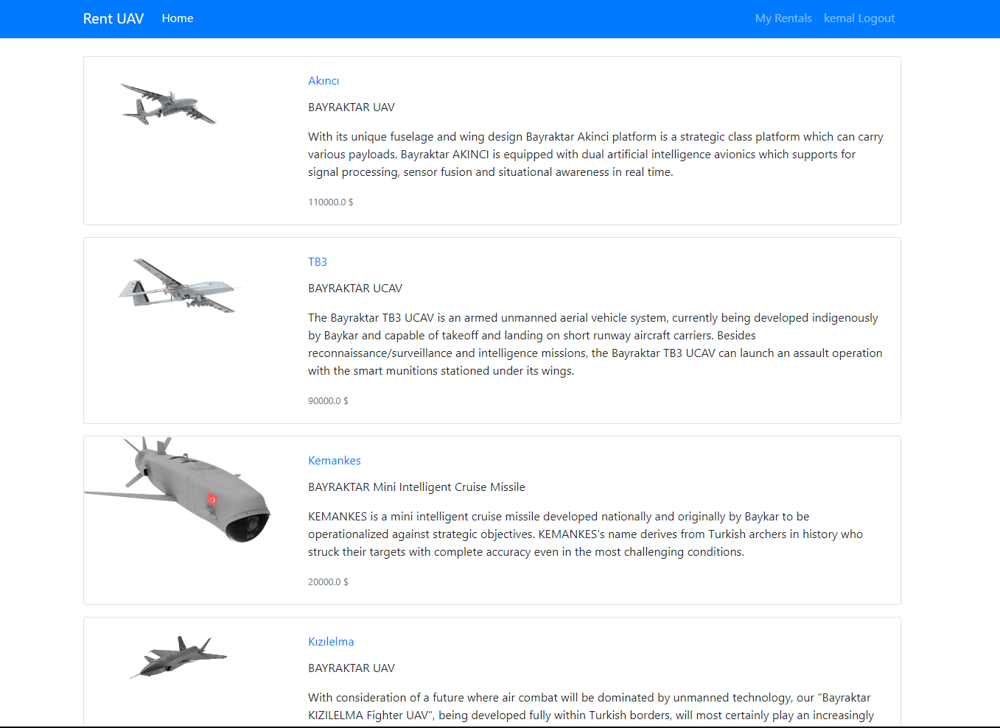
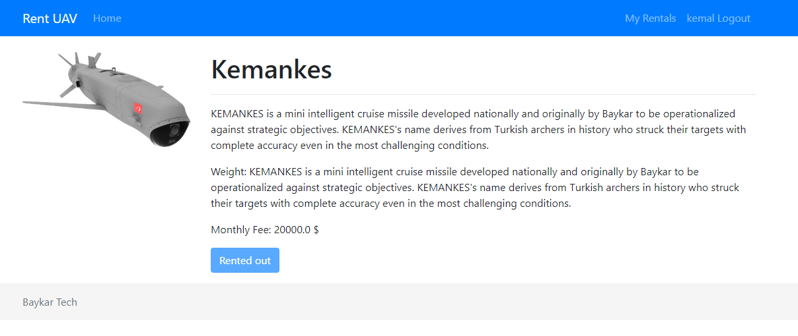
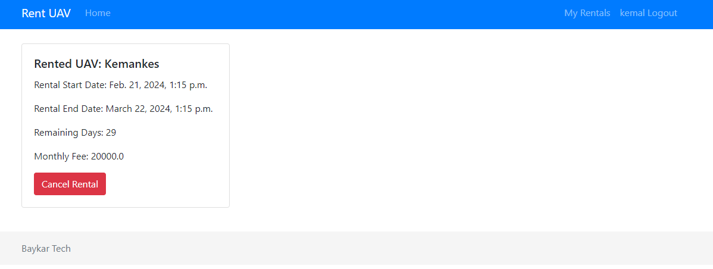
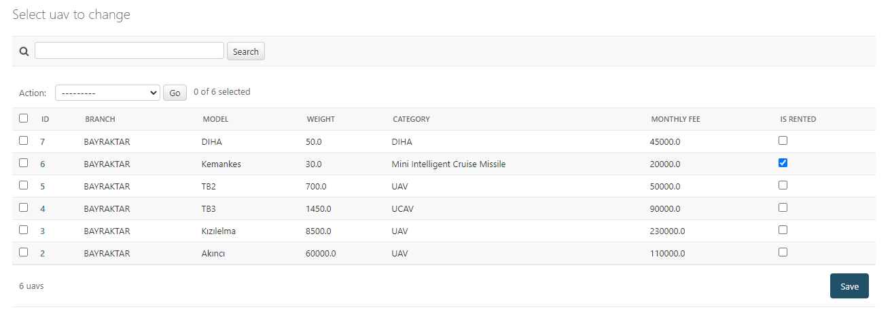

# UAV Rental Management System

This project is a web-based UAV (Unmanned Aerial Vehicle) rental management system developed as part of the application for the Web Software Engineer / Back-End Developer position at Baykar Tech. The system allows users to manage UAVs, rental transactions, and user accounts efficiently.

Functionalities Implemented
User Authentication and Login Screen:

Users can sign up and log in securely to access the system.
UAV Management:

CRUD (Create, Read, Update, Delete) operations for managing UAVs.
Attributes include brand, model, weight, category, etc.
Rental Management:

Renting, canceling, updating, and listing rental transactions.
Rental attributes include UAV, rental dates and times, renting user, etc.
User Rental Records:

Users can view their rental records to keep track of their transactions.
Filtering and Searching:

Filtering and searching functionalities across all listing pages.
Technologies Used
Django: Python web framework used for backend development.
PostgreSQL: Relational database management system used for data storage.
HTML/CSS: Frontend design and styling.

## Getting Started
- Python 3.x
- Django
- PostgreSQL 12


## Models

### UAV Model

The `UAV` model represents an Unmanned Aerial Vehicle.

- `branch`: CharField - Branch of the UAV.
- `model`: CharField - Model of the UAV.
- `weight`: FloatField - Weight of the UAV.
- `category`: CharField - Category of the UAV.
- `monthly_fee`: FloatField - Monthly rental fee of the UAV.
- `is_rented`: BooleanField - Indicates whether the UAV is currently rented.
- `image`: CharField - Path to the image of the UAV.
- `descrtiption`: TextField - Descrtiption of the UAV.

### Rental Model

The `Rental` model represents a rental transaction.

- `uav`: ForeignKey to `UAV` model - The rented UAV.
- `renter`: ForeignKey to User model - The user who rented the UAV.
- `rental_start_date`: DateTimeField - Start date of the rental.
- `rental_end_date`: DateTimeField - End date of the rental.

### Database Configuration
Before running the application, make sure to update the `/rent/rent/.env` file with your database configuration:
```bash
    DB_NAME="your_database_name"
    DB_USER="your_database_user"
    DB_PASSWORD="your_database_password"
    DB_HOST="your_database_host"
    DB_PORT="your_database_port"
```
## Installation


Clone the repository:
```bash
  git clone https://github.com/erensunar/baykar-tech-uav-rental.git
```
Install dependencies:
```bash
  pip install -r requirements.txt
```
Navigate to the project directory:
```bash
  cd rent
```
Set up the database:
```bash
  python manage.py migrate
```
Run the development server:
```bash
  python manage.py runserver
```
```bash
  Access the application in your web browser at http://localhost:8000.
```


    
## Contributing

Contributions are welcome! Feel free to fork the repository and submit pull requests with your improvements.


## Acknowledgements
Special thanks to Baykar Tech for providing the opportunity to work on this project.


## Screenshots







## Video
[](https://youtu.be/HMeskTRxZJE)

